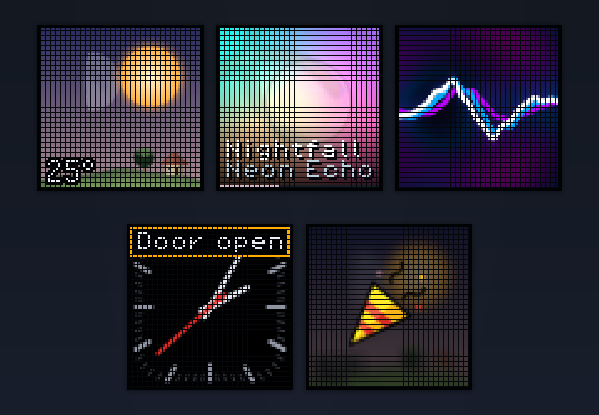

# Pixoo64 replacement firmware

  
  
  
  

Open, Home Assistant-connected replacement firmware for the ESP32 in a Pixoo64,
with animated dashboards, weather, now-playing artwork, notifications, and
reactions—without the Divoom app or cloud.

It uses ESPHome for networking, provisioning, OTA, and the native API while
retaining the panel MCU that refreshes the LEDs.

  

Actual firmware renders with a simulated Pixoo64 LED grid: weather landscape, now playing, color waveform, analog-clock warning notification, and celebration reaction.

## Compatibility

**Tested/documented target:** a Divoom Pixoo64 with a `Pixoo64-Wifi Mainboard`
REV1.1 (`20210318`), ESP32-WROVER-IE, 8 MB flash, and the `Pixoo64 Wifi
LEDBoard` REV1.0 (`20210525`). Other board revisions and variants are unknown.

## Features

- Wi-Fi captive-portal provisioning, ESPHome native API encryption, and
  password-protected OTA updates
- Home Assistant controls for panel power/brightness, solar brightness scheduling,
  text, timezone, weather location and refresh interval, dashboard selection, and
  sounds
- Home Assistant `media_player.*` now-playing dashboard with cover artwork and
  playback progress
- Text, weather, microphone equalizer, Game of Life, clock, stopwatch, and timer
  dashboards
- Notifications, animated reactions, buzzer sounds, front-button controls, and
  diagnostic entities

## Documentation

- [Installation and operation guide](docs/manual.md)
- [Hardware and panel-protocol reference](docs/hardware.md)
- [Firmware architecture](docs/firmware.md)
- [Contributor setup, builds, tests, and generators](CONTRIBUTING.md)
- [Third-party notices](THIRD_PARTY_LICENSES.md)

## License

Copyright (C) 2026 simplyRoba. Original project material is licensed under the
GNU Affero General Public License, version 3 or later
([`AGPL-3.0-or-later`](https://spdx.org/licenses/AGPL-3.0-or-later.html)); see the
full license text in [LICENSE](LICENSE).
Checked-in OpenMoji artwork and bundled fonts have their own terms; see
[THIRD_PARTY_LICENSES.md](THIRD_PARTY_LICENSES.md).

> [!NOTE]
> This independent project is not
affiliated with or endorsed by Divoom; the Divoom and Pixoo64 names identify the
supported hardware.

**This project is developed with AI assistance, reviewed by a critical human.**
